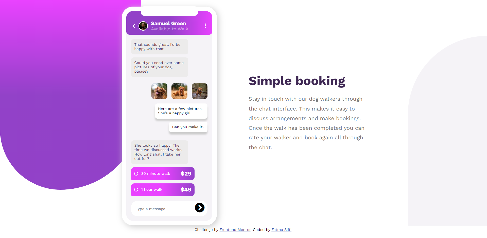
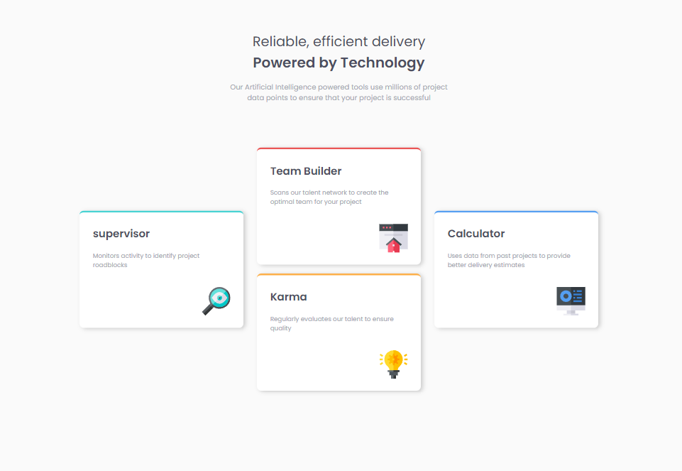
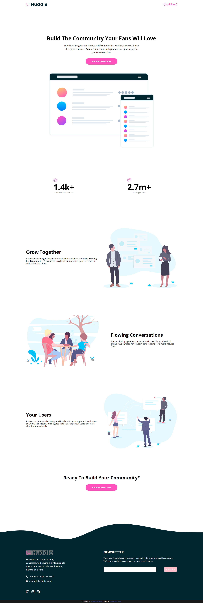
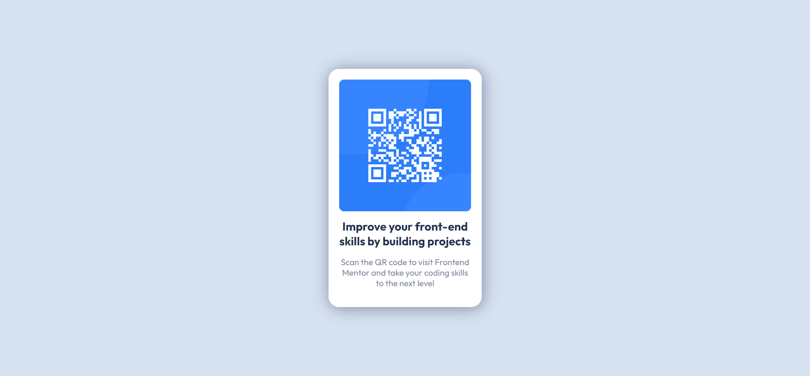

# HTML/CSS Challenges 

This repository contains 6 HTML/CSS challenges that I have completed. Each challenge focuses on building and styling different web components or layouts. Below are the screenshots of the completed challenges:

## Challenge 1

## Challenge 2

## Challenge 3

## Challenge 4

## Challenge 5

## Challenge 6

# Note

The image used in the preview section of this readme is an imitation of the Frontend Mentor challenge and was created by me. It is not the original challenge photo provided by Frontend Mentor
